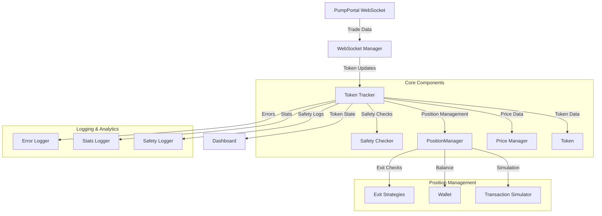
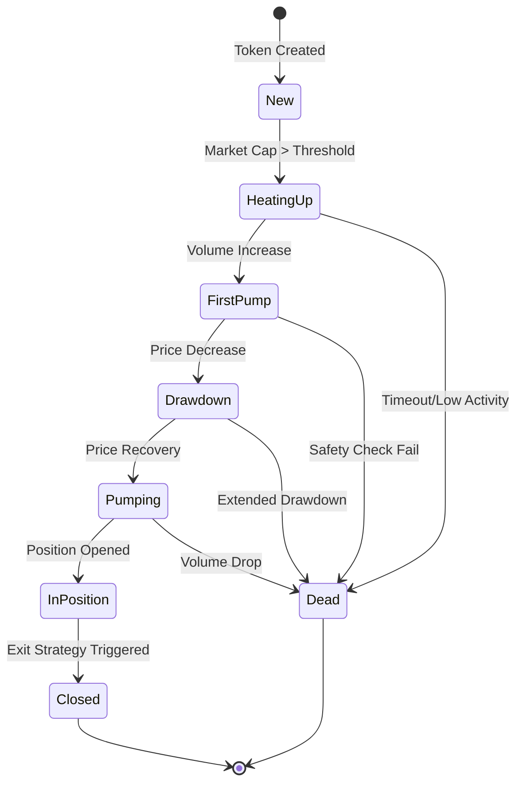

# Money Printer System Architecture

## System Overview

The Money Printer is an automated trading system designed to identify and trade tokens based on market conditions, volume patterns, and safety metrics. The system comprises several interconnected components that work together to analyze market data, make trading decisions, and manage positions.

## Component Responsibilities

### Core Components
- **WebSocket Manager**: Handles real-time data stream from PumpPortal, processes trade events
- **Token Tracker**: Central coordinator managing token lifecycle and state transitions
- **Token**: Maintains token-specific data including volume history, holder metrics, and price information
- **Position Manager**: Manages trading positions, entry/exit execution, and portfolio balance
- **Safety Checker**: Validates token safety through holder analysis and market conditions
- **Price Manager**: Handles price conversions and maintains current market rates

### Logging & Analytics
- **Error Logger**: Centralized error tracking and reporting
- **Stats Logger**: Records trading statistics and performance metrics
- **Safety Logger**: Tracks safety-related events and violations

### Position Management
- **Exit Strategies**: Implements various exit conditions including take profit, stop loss, and volume-based exits
- **Wallet**: Manages account balance and transaction history
- **Transaction Simulator**: Simulates transaction outcomes for risk assessment

## Token Lifecycle

## Data Flow

1. **Market Data Ingestion**
   - WebSocket Manager receives real-time trade data
   - Data is validated and normalized
   - Token updates are broadcast to Token Tracker

2. **Token Processing**
   - Token Tracker updates token states
   - Safety checks are performed
   - Volume and price metrics are calculated
   - State transitions are evaluated

3. **Trading Operations**
   - Position Manager evaluates entry conditions
   - Exit Strategies monitor active positions
   - Transaction Simulator validates trade feasibility
   - Wallet updates reflect position changes

4. **Monitoring & Feedback**
   - Dashboard displays real-time system state
   - Loggers record system events and metrics
   - Performance statistics are updated
   - Safety violations are tracked and reported

## Configuration

The system is highly configurable through `config.js`, allowing adjustment of:
- Trading parameters
- Safety thresholds
- Volume requirements
- Exit strategy settings
- Network configurations
- Logging preferences
