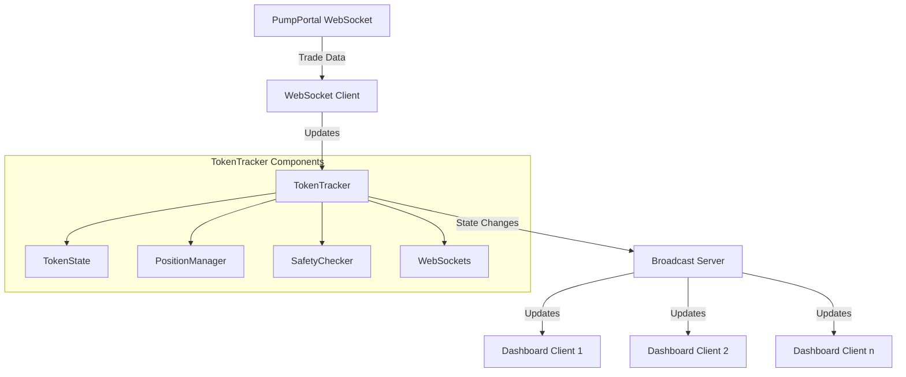
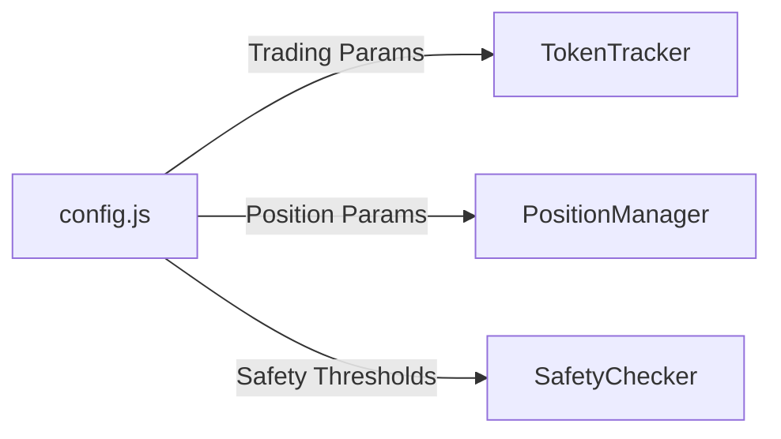
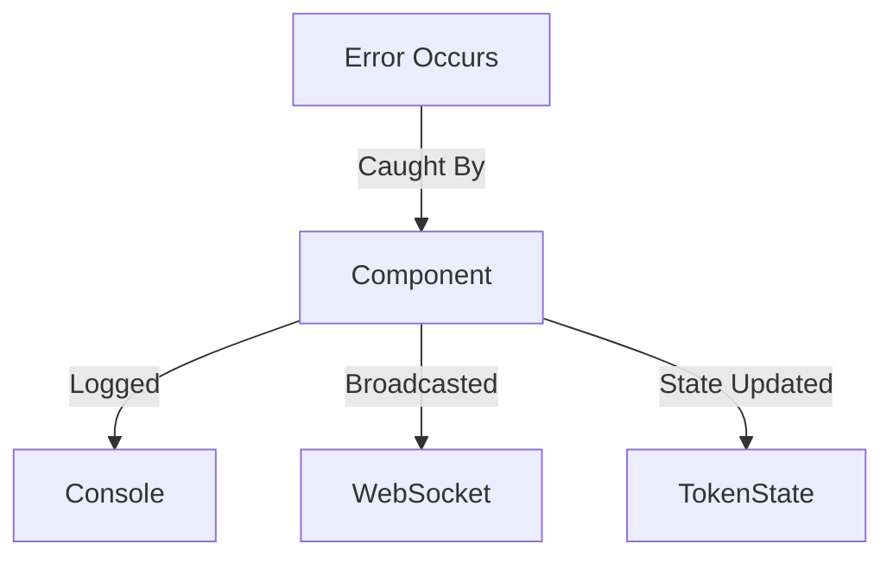
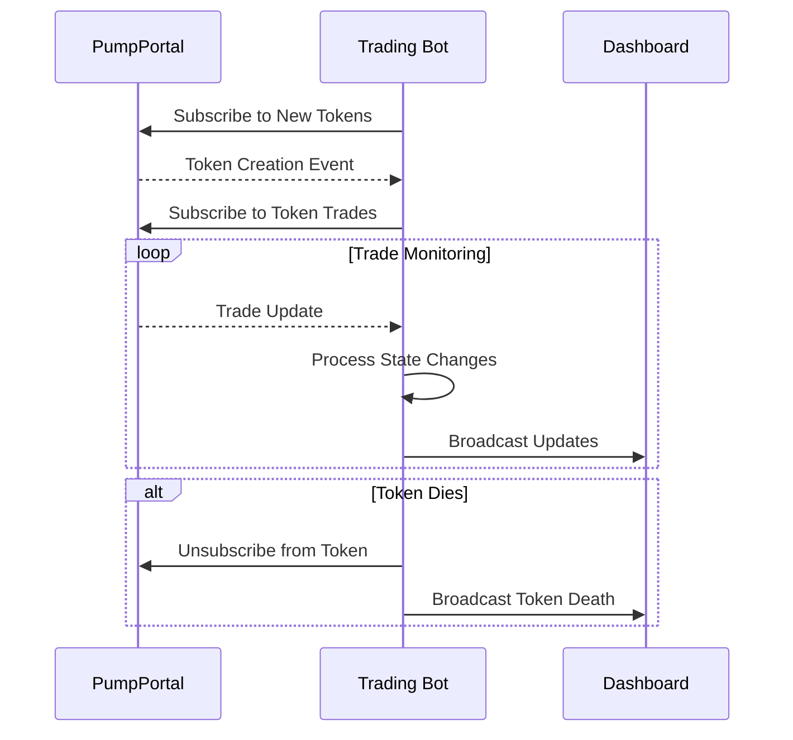
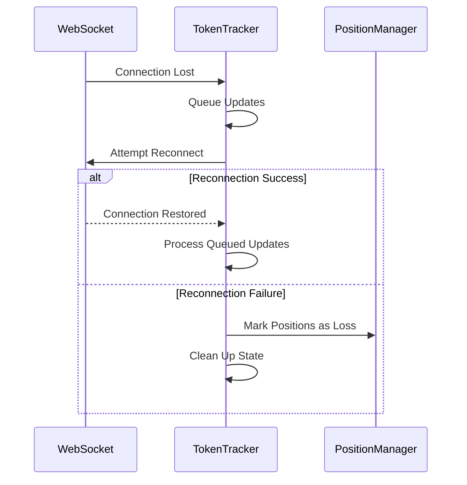

# System Architecture



# Token Lifecycle

````mermaid
stateDiagram-v2
    [*] --> New: Token Created || Overbought
    New --> HeatingUp: Market Cap > HeatingUp Threshold
    New --> Dead: After [Dead Timeout]
    HeatingUp --> FirstPump: Market Cap > First Pump Threshold
    HeatingUp --> Dead: After [Dead Timeout]
    FirstPump --> Drawdown: Price Drop > Drawdown Min
    FirstPump --> Dead: After [Dead Timeout]
    Drawdown --> Pumping: Price Rise > Recovery Threshold
    Drawdown --> Dead: Market Cap < Dead Threshold
    Pumping --> InPosition: If position opened
    Pumping --> Drawdown: Price Drop > Drawdown Min
    Pumping --> Dead: Market Cap < Dead Threshold
    Pumping --> Dead: After [Dead Timeout]
    Drawdown --> Dead: After [Dead Timeout]
    Dead --> [*]

# Architecture Overview

## Component Communication Flow

```mermaid
graph TD
    A[TokenTracker] -->|Manages State| B[TokenState]
    A -->|Validates Safety| C[SafetyChecker]
    A -->|Manages Positions| D[PositionManager]
    A -->|Broadcasts Events| E[WebSocket]

    D -->|Returns Results| A
    B -->|Provides State| A
    C -->|Returns Validation| A
````

## Position Management Flow

```mermaid
sequenceDiagram
    participant TT as TokenTracker
    participant PM as PositionManager
    participant WS as WebSocket

    TT->>PM: openPosition(mint, marketCap)
    PM-->>TT: position object
    TT->>WS: broadcast("positionOpened")

    TT->>PM: closePosition(mint, position, exitPrice)
    PM-->>TT: result object
    TT->>WS: broadcast("positionClosed")
```

## Event Broadcasting

All events are centralized through TokenTracker:

- Position Events (opened, closed, loss)
- State Changes (heating up, pumping, drawdown)
- Safety Alerts (concentration, creator selling)

## Configuration Management



## Error Handling



# WebSocket Communication



# Error Handling


