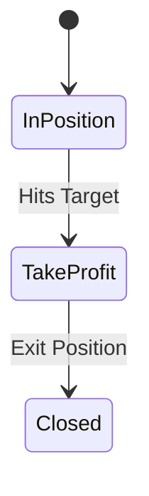
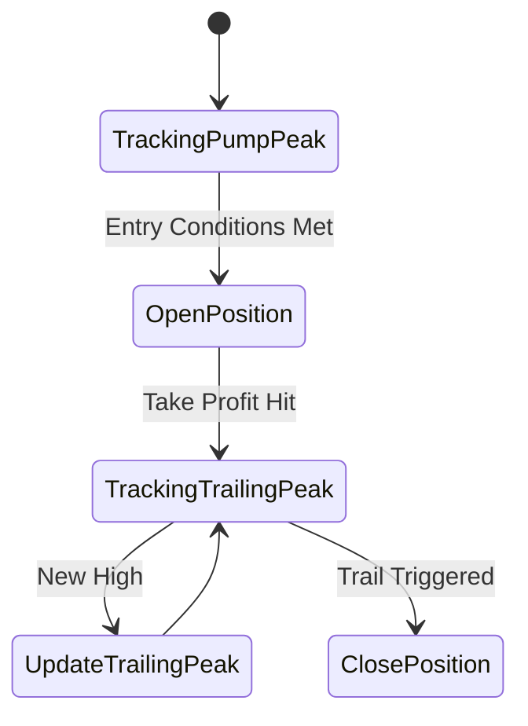
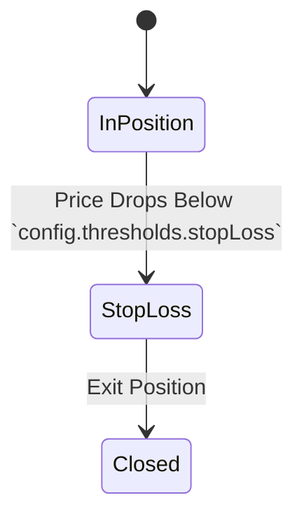
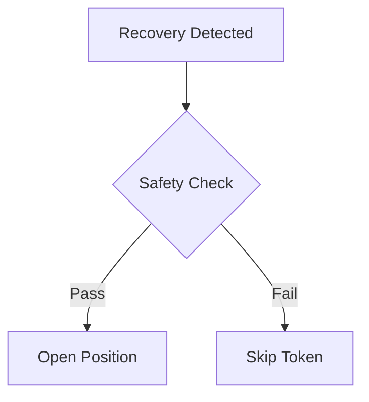

# Trading Scenarios

This document outlines the various trading scenarios handled by the system.

## Initial Pump Detection

```mermaid
stateDiagram-v2
    [*] --> HeatingUp || Overbought if intial market cap > `config.thresholds.heatingUp`
    HeatingUp --> FirstPump: Volume/Price Increase
    FirstPump --> Drawdown: Price Drops
    Drawdown --> Recovery: Price Increases || UnsafeRecovery: Price Increases but Not Safe || TokenDeath: Price Drops Below `config.thresholds.dead`
    Recovery -> EnterPosition: Safety Check Passes || TokenDeath
    UnsafeRecovery -> EnterPosition: Safety Check Passes || TokenDeath
    EnterPosition --> InPosition: Position Opened
    InPosition --> TakeProfit: Hits Target || StopLoss || TrailingTakeProfit || TrailingStopLoss
    TakeProfit --> Closed: Exit Position
    TrailingTakeProfit --> Closed: Exit Position
    TrailingStopLoss --> Closed: Exit Position
    StopLoss --> Closed: Exit Position
    TokenDeath --> Closed: Exit Position
```

It should be noted that the system uses either trailing take profit OR fixed take profit exclusively, based on the `trailingTakeProfit` configuration. Both mechanisms cannot be active simultaneously.

## Take Profit Scenarios

### Standard Take Profit



### Trailing Take Profit



## Stop Loss Scenarios

### Standard Stop Loss



### Trailing Stop Loss


### Trailing Stop Loss and Take Profit


## Position Opening Types



The PositionManager handles both trailing stop loss and take profit scenarios, ensuring that positions are managed according to the configured strategies.
