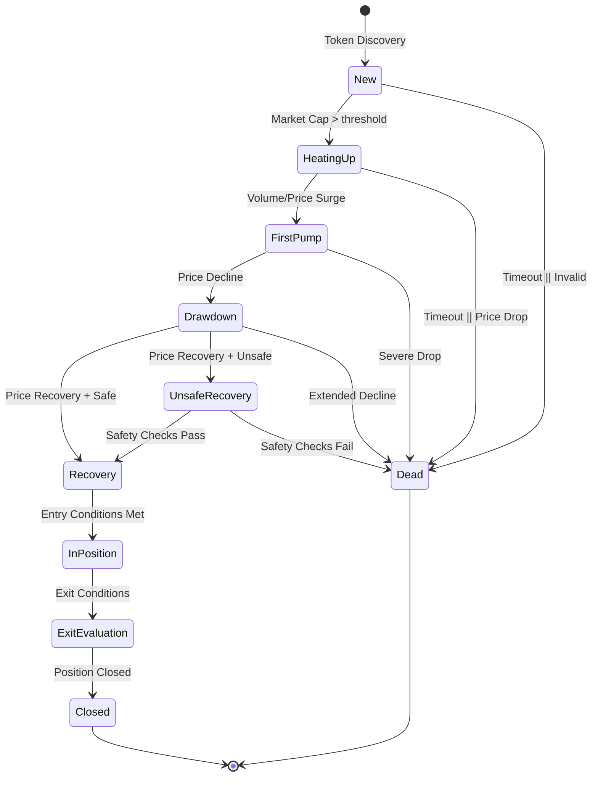
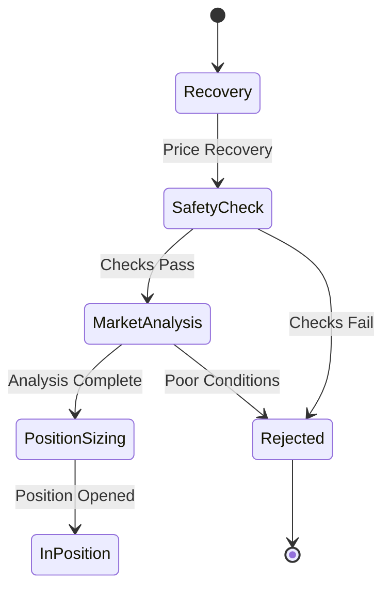
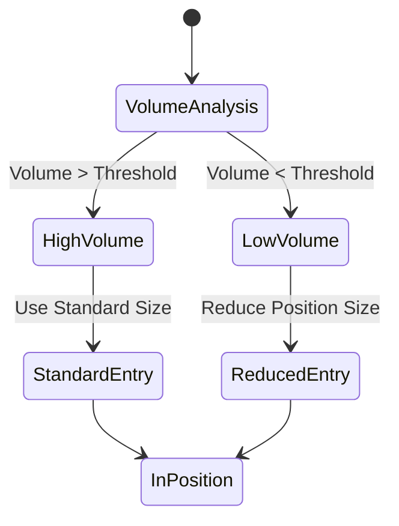
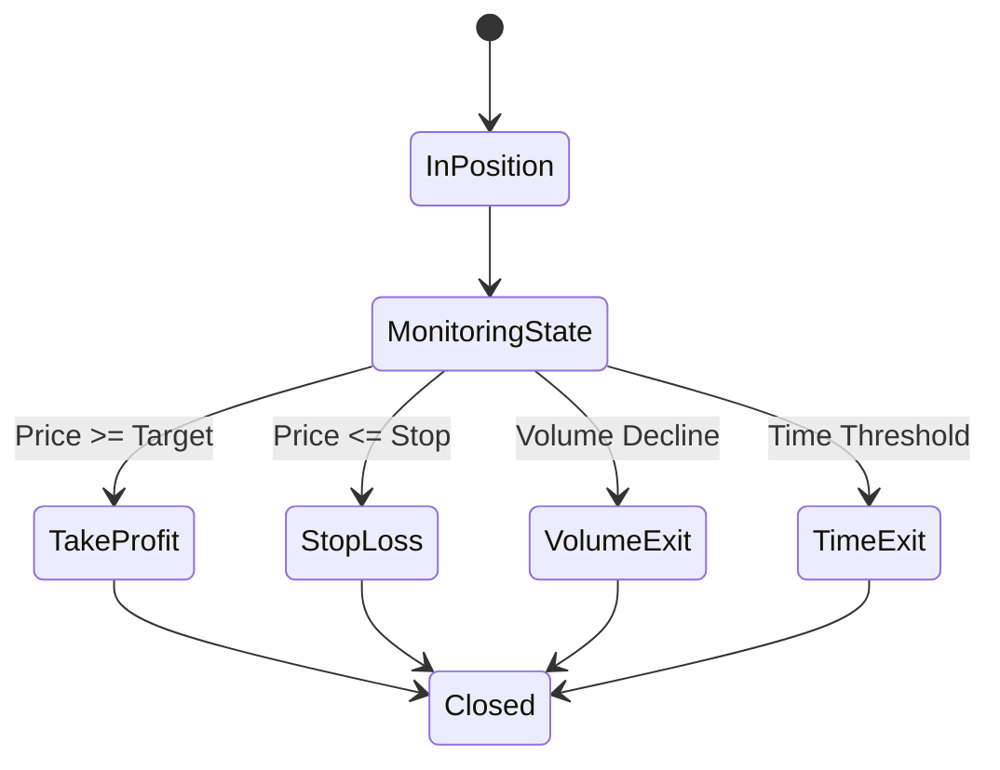
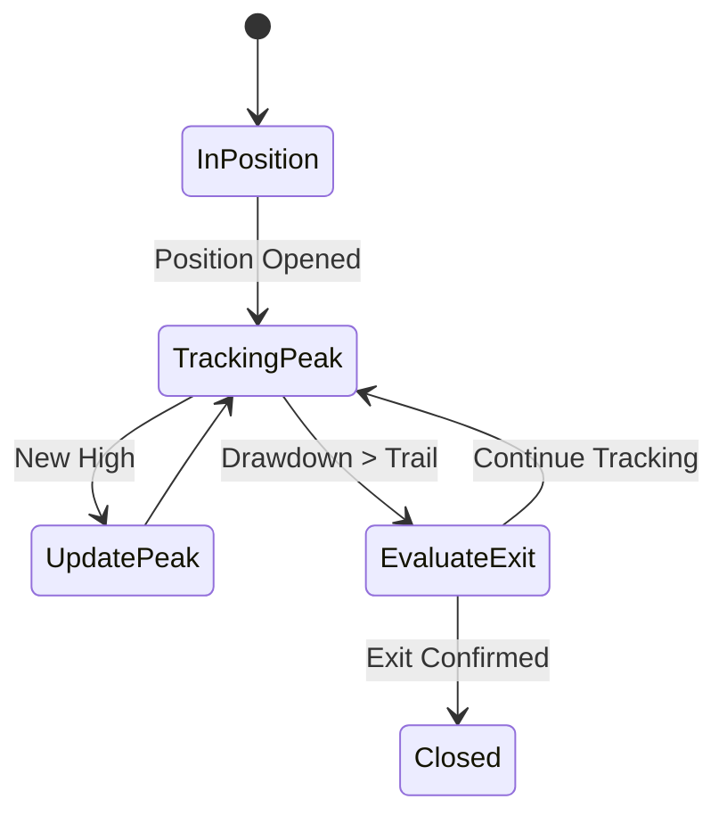
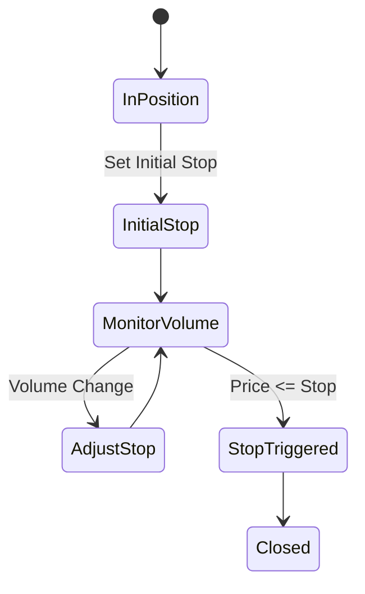
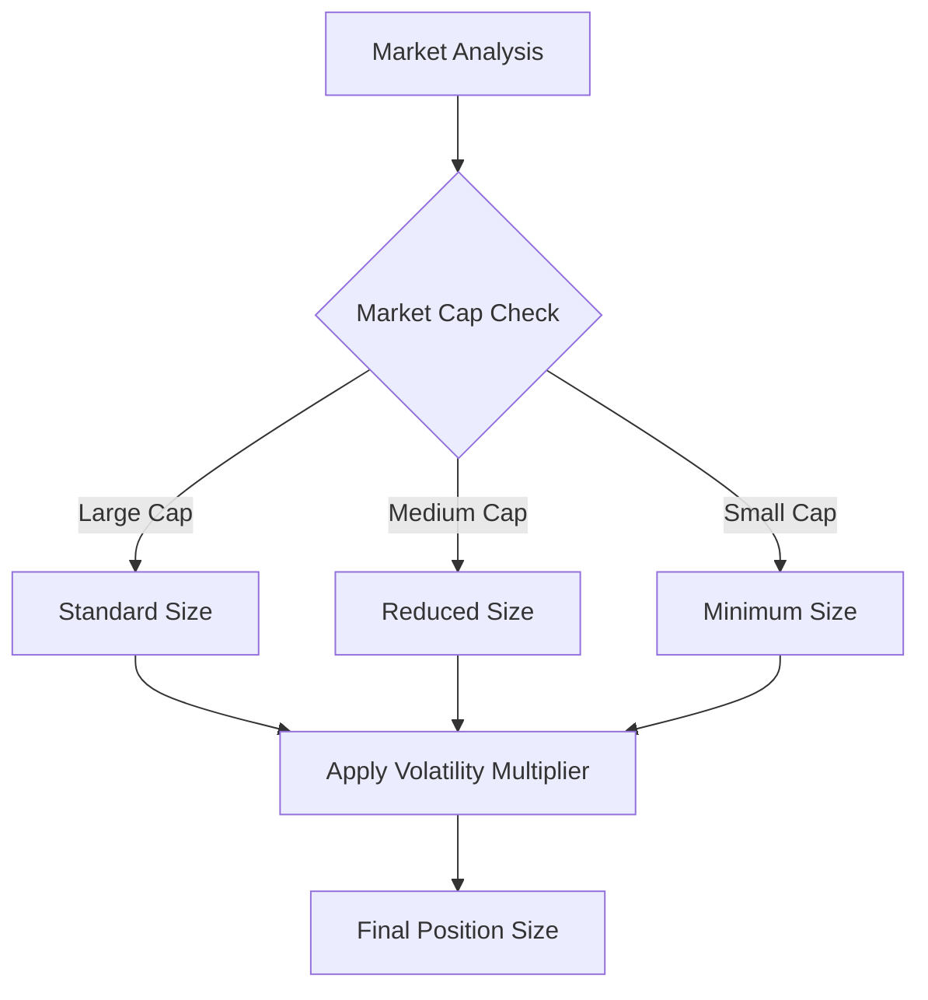
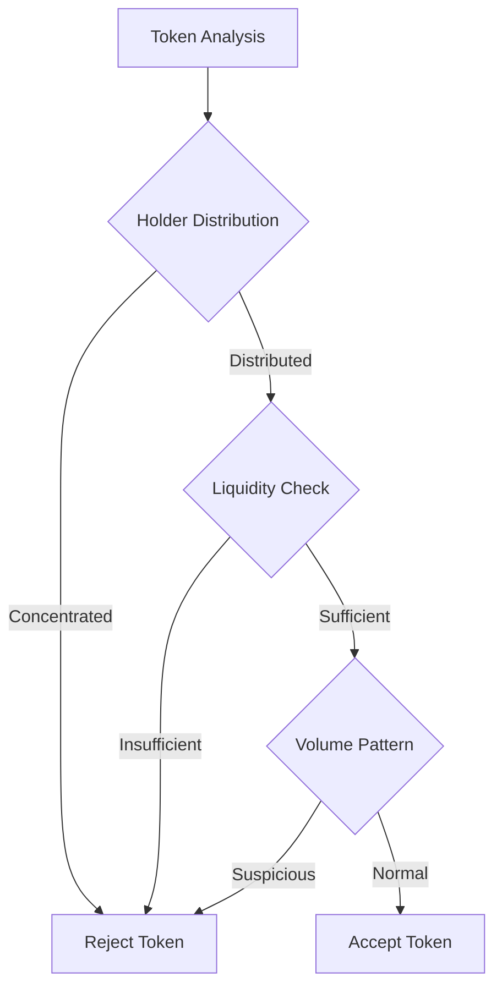
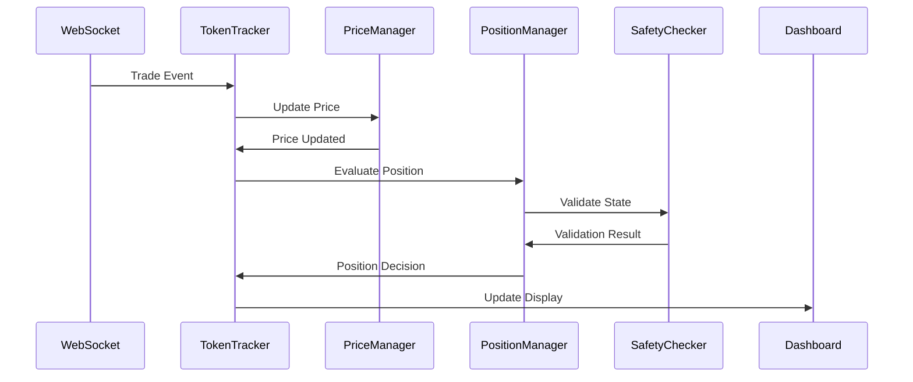

# Trading Scenarios

This document outlines the various trading scenarios and state transitions handled by the system.

## Token Lifecycle Overview

## Position Entry Scenarios

### Standard Entry

### Dynamic Entry with Volume Analysis

## Exit Strategies

### Multi-Condition Exit

### Trailing Take Profit

### Dynamic Stop Loss

## Risk Management Scenarios

### Position Sizing

### Safety Validation

## Event Processing

### Trade Update Flow

## Configuration Notes

1. **Position Management**
   - `trailingTakeProfit`: Enables trailing take profit mechanism
   - `dynamicPositionSizing`: Adjusts position size based on market conditions
   - `multiExitStrategy`: Combines multiple exit conditions

2. **Risk Parameters**
   - `maxPositionSize`: Upper limit for position size
   - `minPositionSize`: Lower limit for position size
   - `riskMultiplier`: Adjusts position size based on volatility

3. **Timing Controls**
   - `entryTimeout`: Maximum time to wait for entry conditions
   - `exitTimeout`: Maximum time to hold position
   - `stateTimeout`: Maximum time in each state

The system uses event-driven architecture to handle state transitions and position management, ensuring responsive and accurate trading execution while maintaining risk management parameters.
